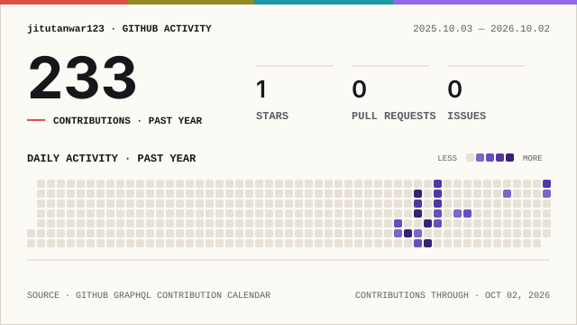

 

  

---

## 👋 About Me

I'm a **B.E. Information Technology student** focused on becoming a strong full-stack developer.

I enjoy building things end-to-end — from clean interfaces and JavaScript logic to APIs, databases, and complete web applications.

### ⚡ What I'm working on

| Area | Stack |
| --- | --- |
| **Frontend** | HTML · CSS · JavaScript · React |
| **Backend** | Node.js · Express |
| **Databases** | SQL · MySQL · MongoDB |
| **Tools** | Git · GitHub · Postman |
| **Problem Solving** | DSA · Interview Preparation |

> 🚀 **Learn → Build → Debug → Understand → Improve**

## 🛠️ Tech Stack

### Languages

### Frontend

### Backend & Databases

### Tools

---

---

## 🚀 Featured Projects

<table>
<tr>
<td width="50%">

### 🐛 IssueTrack

A full-stack issue tracking application for organizing and managing development issues.

**Focus:** CRUD · APIs · Application workflow

<a href="https://github.com/jitutanwar123/IssueTrack">View repository →</a>

</td>
<td width="50%">

### 🌐 Personal Portfolio

A developer portfolio focused on presenting projects, skills, and work in a clean responsive interface.

**Focus:** Frontend · Responsive UI · UX

<a href="https://github.com/jitutanwar123/portfolio">View repository →</a>

</td>
</tr>

<tr>
<td width="50%">

### 🎮 Tic Tac Toe

Interactive browser game built to strengthen JavaScript, DOM manipulation, and game logic.

**Focus:** JavaScript · DOM · Logic

<a href="https://github.com/jitutanwar123/tic-tac-toe">View repository →</a>

</td>
<td width="50%">

### ⏱️ Stopwatch

Lightweight browser stopwatch using vanilla web technologies.

**Focus:** JavaScript · Events · DOM

<a href="https://github.com/jitutanwar123/Stopwatch-web-app">View repository →</a>

</td>
</tr>

<tr>
<td width="50%">

### 🏛️ Civic Sense

A project focused on building a practical civic-oriented web experience.

**Focus:** Web Development · Problem Solving · User Experience

<a href="https://github.com/jitutanwar123/Civic-Sense">View repository →</a>

</td>
<td width="50%">

### 🏪 Stationary

Frontend project exploring practical interfaces and core web-development fundamentals.

**Focus:** UI · Web Development

<a href="https://github.com/jitutanwar123/Stationary">View repository →</a>

</td>
</tr>
</table>

---

## 🧭 Learning Roadmap

→

→

→

→

  

→

→

### Current focus

- 🟢 JavaScript depth
- 🟡 React development
- ⚪ Node.js + Express
- ⚪ SQL & database design
- ⚪ Full MERN applications
- ⚪ DSA & interview preparation
- ⚪ Production-style projects

---

## 📊 GitHub Activity

  
  

  <b>Self-hosted GitHub activity card</b> 
  Generated automatically with GitHub Actions and stored in this repository.

<picture>
  <source media="(prefers-color-scheme: dark)" srcset="./profile/signal-field-wide-dark.svg">
  <source media="(prefers-color-scheme: light)" srcset="./profile/signal-field-wide-light.svg">
  
</picture>

  <a href="https://github.com/jitutanwar123">Open my live GitHub contribution graph →</a>

---

## 🧠 Development Loop

→

→

→

→

→

 

I learn best by implementation. Build something, break it, debug it, understand why it works, and then improve it.

---

## 🏗️ Engineering Principles

| Principle | What it means |
| --- | --- |
| **Understand first** | Learn the reasoning behind the technology |
| **Build continuously** | Turn concepts into working software |
| **Debug deeply** | Treat errors as part of the learning process |
| **Keep improving** | Refactor instead of stopping at “it works” |
| **Build with purpose** | Prefer projects that solve useful problems |

---

## 🎯 What I'm Building Toward

<pre>
B.E. Information Technology
          │
          ▼
    JavaScript Depth
          │
          ▼
     Full-Stack MERN
          │
          ▼
   APIs + Databases
          │
          ▼
      DSA + CS
          │
          ▼
Production-Ready Projects
          │
          ▼
   Software Engineering
</pre>

---

## 🤝 Let's Connect

  

### Code → Learn → Build → Improve

